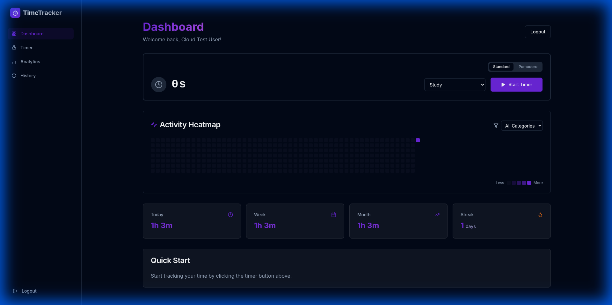
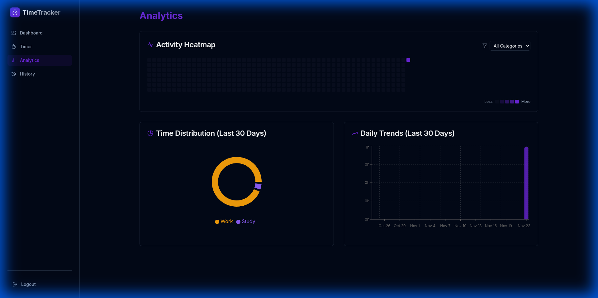
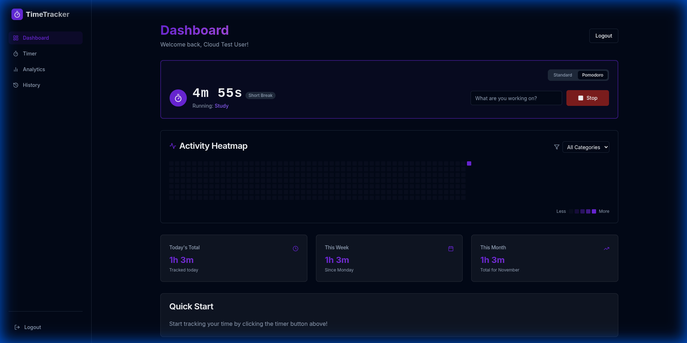
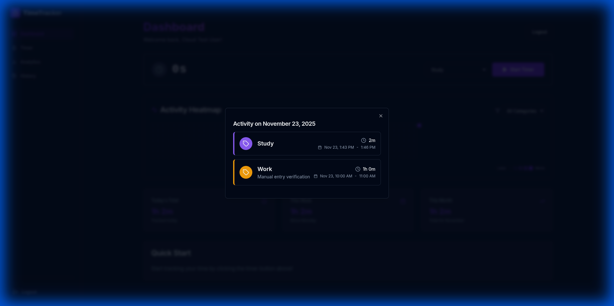

# Time Tracker Pro 🚀

A modern, full-stack time tracking application built with React, Node.js, and MongoDB. Track your productivity, visualize your habits, and stay focused with Pomodoro timers.



## ✨ Features

-   **⏱️ Live Timer**: Real-time tracking with start/stop functionality and automatic recovery.
-   **🍅 Pomodoro Mode**: Built-in Focus (25m), Short Break (5m), and Long Break (15m) timers.
-   **📊 Visual Analytics**:
    -   **Heatmap**: GitHub-style activity visualization.
    -   **Distribution**: Pie charts showing time spent per category.
    -   **Trends**: Daily activity bar charts.
-   **🔥 Gamification**: Track your daily streaks to stay motivated.
-   **📝 Manual Entry**: Log past activities with a user-friendly form.
-   **📂 Categories**: Organize time by custom categories (Work, Study, Exercise, etc.).
-   **📥 Data Export**: Export your history to CSV for external analysis.
-   **🔐 Secure Auth**: JWT-based authentication with persistent sessions.
-   **🌓 Dark Mode**: Sleek, glassmorphism-inspired dark UI.

## 🛠️ Tech Stack

-   **Frontend**: React, Vite, TypeScript, TailwindCSS, Framer Motion, Recharts
-   **Backend**: Node.js, Express, TypeScript
-   **Database**: MongoDB Atlas, Prisma ORM
-   **Deployment**: PM2, Production-ready build configuration

## 📸 Screenshots

### Analytics & Charts
Visualize your productivity patterns with detailed charts.


### Pomodoro Timer
Stay focused with the integrated Pomodoro timer.


### Activity Heatmap
See your consistency at a glance.


## 🚀 Getting Started

### Prerequisites

-   Node.js (v18+)
-   npm (v9+)
-   MongoDB Atlas account (or local MongoDB)

### Installation

1.  **Clone the repository**
    ```bash
    git clone https://github.com/sagar-subedi/timetracker.git
    cd timetracker
    ```

2.  **Install Dependencies**
    ```bash
    npm install
    npm run install:all
    ```

3.  **Environment Setup**
    Create a `.env` file in the `backend` directory:
    ```env
    DATABASE_URL="mongodb+srv://<username>:<password>@cluster0.xxxxx.mongodb.net/timetracker"
    JWT_SECRET="your-super-secret-key"
    PORT=3001
    ```

4.  **Database Setup**
    ```bash
    cd backend
    npx prisma db push
    npx prisma generate
    ```

### Running Locally

Start both frontend and backend servers concurrently:

```bash
npm run dev
```
Access the app at `http://localhost:5173`.

## 📦 Deployment

This project is configured for production deployment. The backend serves the frontend static files.

1.  **Build**
    ```bash
    cd frontend && npm run build
    cd ../backend && npm run build
    ```

2.  **Run with PM2**
    ```bash
    cd backend
    npx pm2 start ecosystem.config.cjs
    ```

See [DEPLOY.md](DEPLOY.md) for a detailed deployment guide.

## 📄 License

MIT License - feel free to use this project for your own productivity!
